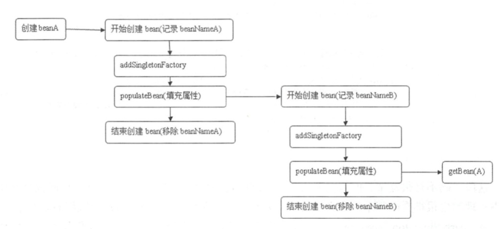

# 张鹏 
- 1.BeanDefinition 是什么?为什么要有这个?这个对我们写代码有什么借鉴意义

    Spring容器启动时读取配置信息将各种bean的基本配置信息读取到对应BeanDefinition，用于生成bean时调用。所以BeanDefinition就像是一个存储了特定信息的模版文件；
    
    如果没有BeanDefinition就变成一边解析一边创建，而且用到bean配置信息的地方需要再次解析。
    
    Spring创建bean的过程比较复杂而且bean之间有相互依赖，通过BeanDefinition让用户可以简单的配置bean参数而不用管复杂的创建过程。这里用到了外观模式，通过一个接口，将内部复杂的实现隐藏，对外客户端暴露简单的接口，实现了解耦。比如我们的下单接口调用方只需要传一个简单的param

- 2.从容器角度,将了解到的概念,用一个简单直接的话或图描述

  1. BeanFactory 
    
        是IOC容器的核心接口，用于配置，创建，管理各种Bean，只不过BeanFactory是一个顶层接口为实现类提供了基础的规范
    
  2. BeanDefinition
    
        容器中用于承载bean配置信息的类
    
  3. FactoryBean
  
        为IOC容器中Bean的实现提供一个简单的工厂和装饰模式，可以在getObject()方法中增加复杂的逻辑

# 阮天炜
1. 已知Spring可以解决单例模式，属性中循环依赖，Setter注入的循环依赖问题，但是为什么Spring只能解决这个特定的依赖问题，解决它所用到的原理大致介绍一下。
   什么是循环依赖：循环依赖即是循环引用，指多个bean之间互相持有对方。Spring的循环依赖分为：1、构造器循环依赖；2、setter循环依赖就是属性循环依赖；
   
   单例模式： 
   - 构造器循环依赖 
   
       创建bean前执行下面这个方法  
       beforeSingletonCreation这个方法的作用是检查bean是否在创建中，如果是抛出异常BeanCurrentlyInCreationException  
       createBeanInstance创建bean实例，如果形成了 A - B - A
       则在beforeSingletonCreation中抛出异常
   
   - setter循环依赖
   
       ```java
            // org.springframework.beans.factory.support.AbstractAutowireCapableBeanFactory.doCreateBean
            // 为了避免后期循环依赖，可以在bean初始化完成前将创建实例的ObjectFactory加入工厂
            addSingletonFactory(beanName,
                    // 主要用于解决循环引用问题，对bean再一次依赖引用，主要应用SmartInstantiationAware BeanPostProcessor
                    // 其中我们熟知的AOP就是在这里将advice动态织入bean中，若没有则直接返回bean，不做任何处理。
                    () -> getEarlyBeanReference(beanName, mbd, bean)
            );
        ```
        
        setter循环依赖如下图，当出现A - B -
        A的时候getBean（A）就会调用上面的getEarlyBeanReference并不会重新创建bean。参考：
        
        ```java
        org.springframework.beans.factory.support.AbstractBeanFactory.doGetBean ->
        org.springframework.beans.factory.support.DefaultSingletonBeanRegistry.getSingleton(java.lang.String)
        ```
       
       
   
   
   
   原型模式：Spring容器不缓存"prototype"作用域的bean，所以无法提前暴露一个创建中的bean，不能解决循环依赖。

2. Spring的lookup-method 和 replace-method
   用的不多，但是也有一定的应用场景。简单说一下我们实际可以运用的场景。

    这两个方法的配置放在BeanDefinition#
    这两种方法用的不多，一些在xml里面配置的bean可能用的着。如果在代码里切换实现类可以使用@Autowired、@Qualifier("xxx")这两个注解替代，替换方法可以使用aop

- lookup-method 获取器注入 

    一种特殊的注入方式，把一个方法声明为返回某种类型的bean，实际返回的bean是在配置文件里面配置的，此方法可用在设计有些可插拔的功能上，解除程序依赖

- replace-method

    可以在运行时用新的方法替换现有的方法


# 刘佳缘 
1. Spring起来后有几个spring容器？只有一个吗？
2. BeanDefinitionRegistryPostProcessor、BeanFactoryPostProcessor、BeanPostProcessor（这个没看到可以先留着）在什么时候触发？
3. BeanDefinitionRegistryPostProcessor、BeanFactoryPostProcessor触发是否有顺序，如果有顺序，那么是以怎么样的顺序进行触发的？
